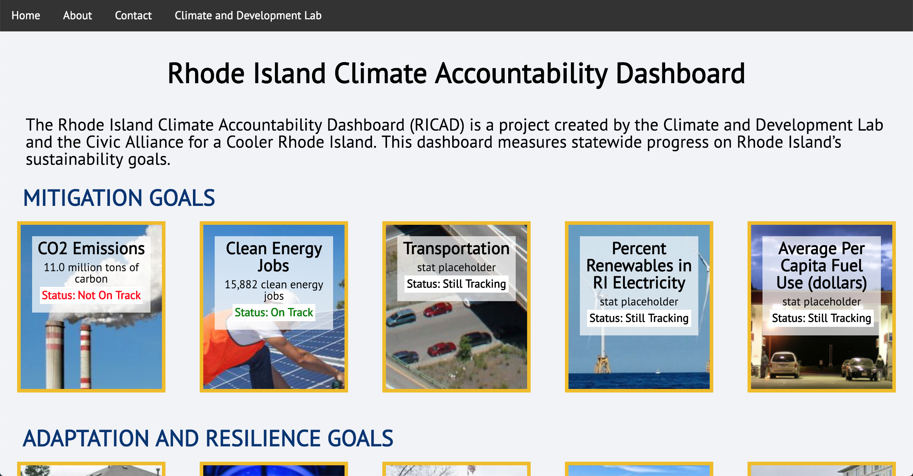
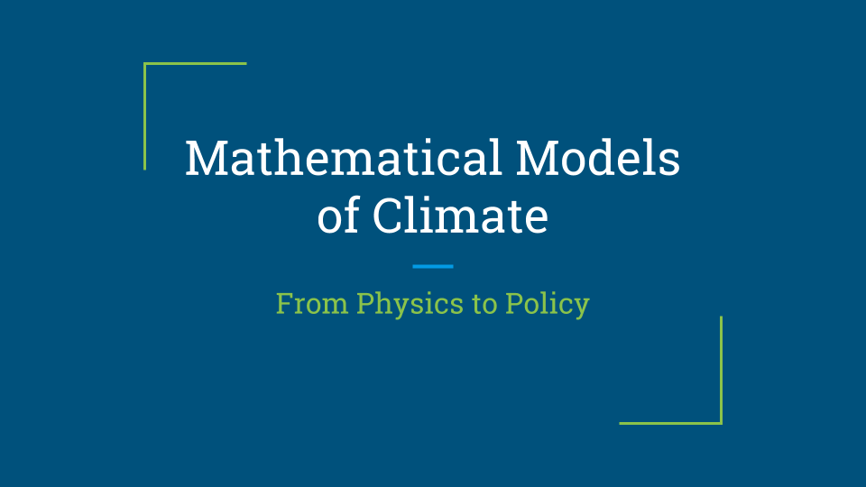
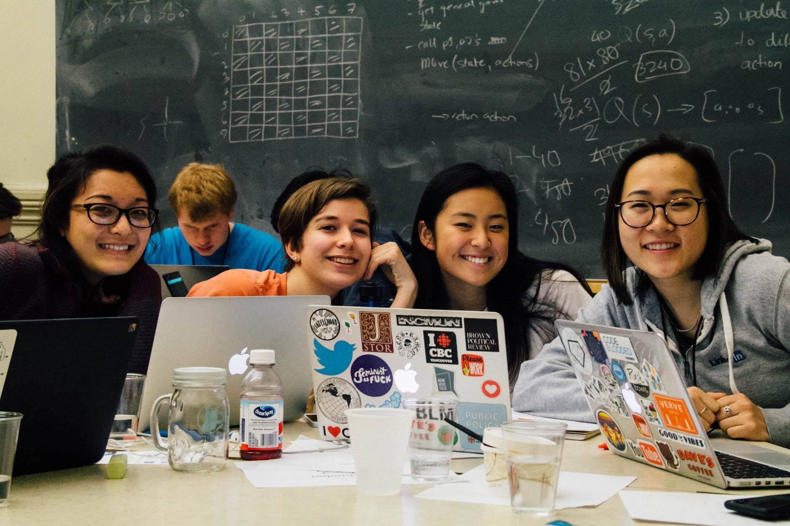

## current

### Dear Blueno Sentiment Analysis
[Dear Blueno](https://www.facebook.com/dearblueno/) is Facebook page for the Brown University community to post anonymous comments and requests for advice. The page's content is often characterized as divisive, and even toxic. I wish to explore the validity of the page's negative reputation by conducting sentiment analysis using spaCy.

## past projects

### Palo Alto Electric Vehicle Charging (May 2019)
For our final project for Big Data (ECON 1660), my group investigated electric vehicle charging station demand, using Palo Alto as an idealized setting to analyze demand in a world where EVs are highly adopted. My role specifically entailed estimating parameters, working on simulations, and helping write and editing our article. We published our results on Medium – check out our article [here](https://medium.com/@angiejwkim/electric-vehicle-charging-policies-effect-on-charging-demand-41b477e74128)!

**Main takeaways**: Created a statistical model, learned about Poisson processes. Worked with pandas, matplotlib, scikit-learn, and NumPy.

---
### Rhode Island Greenhouse Gas Study (Winter 2019)
I provided supporting research for the development of a model for 100% emissions reduction in Rhode Island by 2050 and policy pathways that would allow the state to reach that target. In particular, I looked at grid decarbonization and methane leakage in natural gas pipes. This study, conducted by the Stockholm Environment Institute and Professor Timmons Roberts' Climate and Development Lab at Brown, aims to follow up on the modelling done for the existing 80% reduction target set by the 2014 Resilient Rhode Island Act and to create a bolder vision for state environmental policy. We hope to work in close partnership with the state government throughout this process.

---
### Rhode Island Climate Accountability Dashboard (Fall 2018)
As a student in the 12-person course Engaged Climate Policy in the US: Rhode Island and Washington, DC (ENVS 1574), my semester project involved creating a dashboard to track progress made on state climate goals. With another student in the class, I developed indicators and a first version of the website. At the end of the semester, we presented our dashboard to the RI Executive Coordinating Council on Climate Change and are looking forward to working with them further to promote public accountability on climate action by the state.

**Main takeaways**: Gained further experience with web development using HTML/CSS, got exposure to Node.js, worked with community partners to iterate upon our original design, and wrote a report delivered to the heads of 12 state agencies.

---
### Climate Model Overview (Fall 2018)
During the Fall 2018 semester, I was accepted into the inaugural cohort of the Applied Mathematics Directed Reading Program, a selective program in which I was paired with a graduate student mentor to read papers about a topic of my choice. Based on my interests in dynamical systems and environmental studies, I chose to explore zero- and one-dimensional climate models. The semester's work culminated in a 15-minute presentation.

**Main takeaways**: Read interesting mathematical papers, applied qualitative analysis of ODEs that I learned from my coursework, got hands-on experience doing numerical simulation using MATLAB, familiarized myself with a model coupling the biosphere and the economy, and created an accessible mathematical presentation.

---
### Gene Fusion Database (Summer 2018)
My 2018 summer internship at the Rhode Island Hospital involved developing an application for automatic text classification for gene fusion papers using a neural network. 

**Main takeaways**: Gained proficiency in TensorFlow, SQL, and data processing and pipelining.

---
### Today's the Day (Hack@Brown, Winter 2018)
One semester into my computer science education, I participated in my first hackathon. Out of our interest in productivity and organization, we developed [Today's the Day](https://chrome.google.com/webstore/detail/todays-the-day/amlbljdjjmjfcdcaajlghnboiolnbnnd?fbclid=IwAR0ofiif75wHJrfp9LBODGDMgV_NG4RSNRTgHP2LeUgKMu3c0jVaiPM7ip8), a Chrome extension that overrides the default new tab page to display upcoming events using Google Calendar integration.

**Main takeaways**: Finally understood what a hackathon really was, decided it wasn't really my thing, but learned how to use APIs and built my very first real project with some great people.

[Go back home](/).